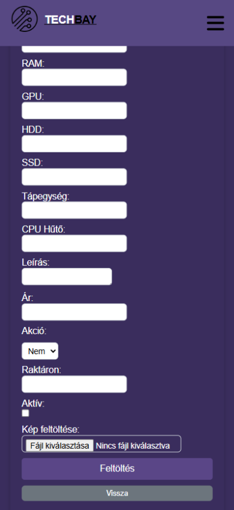
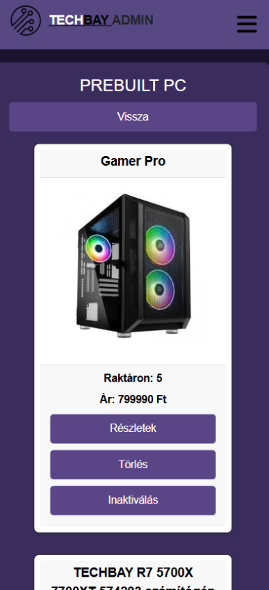
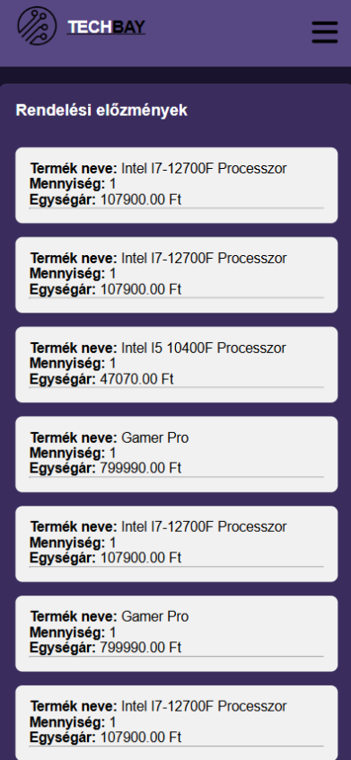
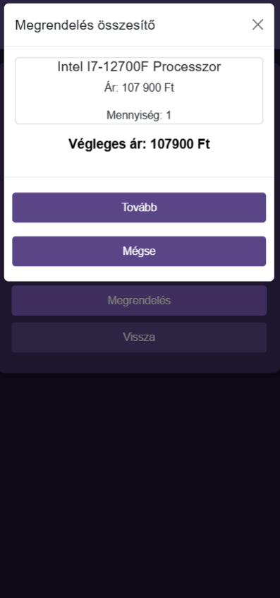
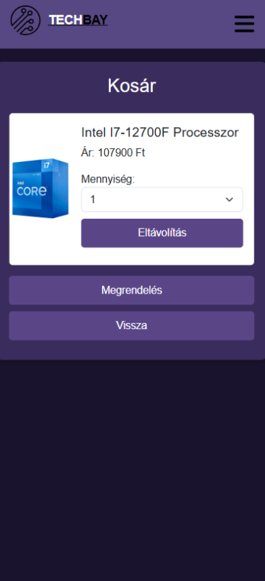
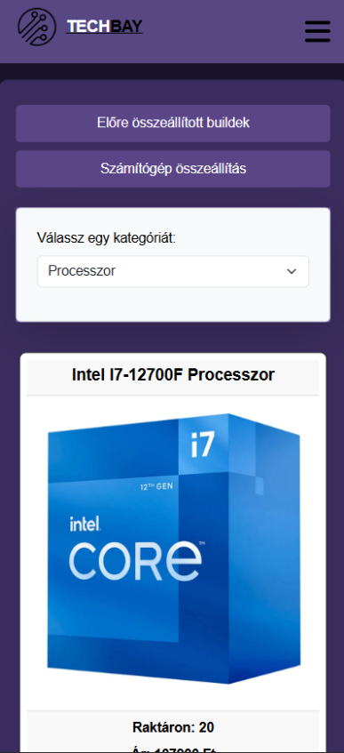
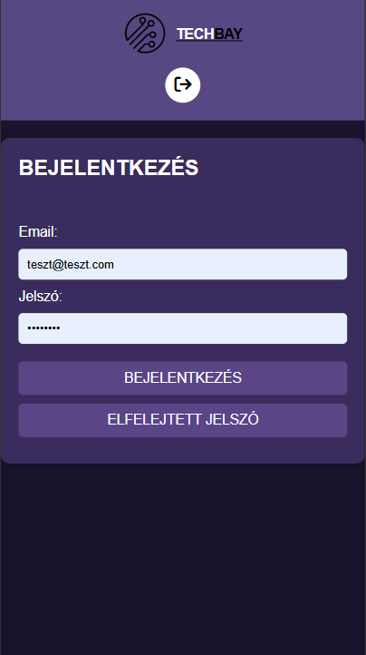
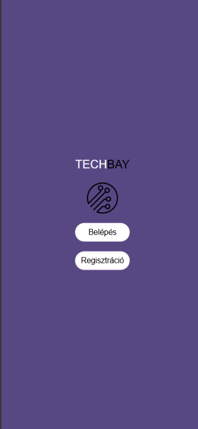

# TechBay Projekt  
*Készítette: Semjéni Gyula*

---

## Bemutatás

A TechBay webáruház egy modern, informatika fókuszú online áruház, amely a magyar piacon a legkeresettebb számítástechnikai alkatrészeket és termékeket kínálja. Professzionális gépösszeszerelési lehetőséget is biztosítunk, és a jövőben további szolgáltatások bevezetése is tervben van.

---

## Fejlesztési környezet

- **Backend:** Node.js  
- **Adatbázis:** MySQL  
- **Frontend:** HTML, CSS, JavaScript

---

## Adatbázis struktúra

### Felhasználói táblák

#### `users`
- `user_id`  
- `email`  
- `password`  
- `create_at`  
- `name`  
- `profile_pic`  
- `admin`  

#### `user_info`
- `userinfo_id`  
- `city`  
- `street`  
- `fullname`  
- `postcode`  
- `user_id` *(kapcsolódik az users táblához)*

### Vásárlással kapcsolatos táblák

#### `cart`
- `cart_id`  
- `user_id`

#### `cart_items`
- `cart_item_id`  
- `cart_id`  
- `product_id`  
- `quantity`  
- `cat_id`

#### `category`
- `cat_id`  
- `category_name`

#### `orders`
- `order_id`  
- `user_id`  
- `order_date`  
- `total_amount`

#### `order_items`
- `order_item_id`  
- `order_id`  
- `product_id`  
- `quantity`  
- `unit_price`

#### `order_items_archive`
- `order_item_id`  
- `order_id`  
- `product_id`  
- `quantity`  
- `unit_price`  
- `order_time`  
- `status`  
- `order_order_id`

### Termékek és PC-k

#### `product`
- `product_id`  
- `product_name`  
- `price`  
- `in_stock`  
- `cat_id`  
- `sale`  
- `sale_`  
- `product_pic`  
- `description`

#### `pc_config`
- `pc_id`  
- `cpu`  
- `mother_board`  
- `house`  
- `ram`  
- `gpu`  
- `hdd`  
- `ssd`  
- `power_supply`  
- `cpu_cooler`  
- `pc_price`  
- `in_stock`  
- `cat_id`  
- `sale`  
- `sale_`  
- `pc_name`  
- `pc_pic`  
- `pc_description`  
- `active`

#### `yourbuild`
- `pc_id`  
- `user_id`  
- `cpu`  
- `mother_board`  
- `house`  
- `ram`  
- `gpu`  
- `hdd`  
- `ssd`  
- `power_supply`  
- `cpu_cooler`  
- `cat_id`

#### `yourbuild_price`
- `pc_id`  
- `cpu_price`  
- `motherboard_price`  
- `house_price`  
- `ram_price`  
- `gpu_price`  
- `hdd_price`  
- `ssd_price`  
- `power_supply_price`  
- `cpu_cooler_price`  
- `price` *(összesített ár)*

---

## Backend

### `app.js`
- Végpontok regisztrálása
- CORS és express middleware-ek beállítása

### Middleware-ek
- `admin.js` – admin jogosultság
- `jwtAuth.js` – token kezelés
- `limiter.js` – rate limiter
- `multer.js` – képfeltöltés

### `.env` változók
- `PORT`  
- `DB_USER`  
- `DB_PASSWORD`  
- `DB_NAME`  
- `JWT_SECRET` stb.

### `db.js`
- MySQL kapcsolat létrehozása

### API végpontok
```
/api/auth            – bejelentkezés, regisztráció  
/api/profile         – profilbeállítás  
/api/cart            – kosár műveletek  
/api/add             – admin termékhozzáadás  
/api/getProducts     – termékek lekérése  
/api/delete          – admin törlés  
/api/edit            – admin szerkesztés  
/api/order           – rendelés  
/api/build           – PC összerakó
```

### `server.js`
- `.env` betöltés, szerver indítása

---

## Admin felület
Az admin felületen a termékek feltölése szerkezstése és sok más található
- Az admin felületre úgy tudsz belépni hogy ha van admin jogod akkor az egyből oda dob be és kiírja hogy `admin jogokkal beléptél!` ezzel is felhívja a figyelmedet hogy ez eghy admin fiók
- Amikor belépsz akkor dönti el hogy admin vagy e ha nem vagy az akkor a felhasználói oldalra dob be
- Admin fiókot nem lehet létrehozni csak adatbázisba tudunk adni
- Minden feltöltéshez illetve más dologhoz vagyis `inaktivitáshoz`,`szerkesztéshez` és sok más dologhoz admin fiókba kell lenned vagyis ha valahogy megtudod a végpontnak a nevét akkor se fogsz tudni termékekt felvinni és semmit amihez kell admin


## Frontend

### Mappaszerkezet
- `css/` – stílusfájlok  
- `img/` – képek  
- `js/` – JavaScript fájlok  
- HTML oldalak: `cart.html`, `home.html`, `login.html`, `registration.html`, stb.

### Fontosabb JS fájlok
- `cart.js` – kosárkezelés  
- `home.js` – terméklistázás  
- `homeAdmin.js` – admin funkciók  
- `login.js`, `registration.js` – bejelentkezés, regisztráció  
- `profile.js`, `profilePic.js` – profil  
- `pcBuilding.js` – gépösszeállítás  
- `preBuilt.js`, `preBuiltAdmin.js` – előre gépek  
- `uploadProduct.js` – termékfeltöltés

----


## Használt npm csomagok

### Backend
- `bcrypt` – jelszavak hash-elése  
- `dotenv` – környezeti változók  
- `express` – backend keretrendszer  
- `express-rate-limit` – lekérés korlátozás  
- `jsonwebtoken` – JWT hitelesítés  
- `multer` – fájlfeltöltés  
- `mysql2` – MySQL driver  
- `validator` – validálás  
- `cors` – CORS kezelés  


## Képek











